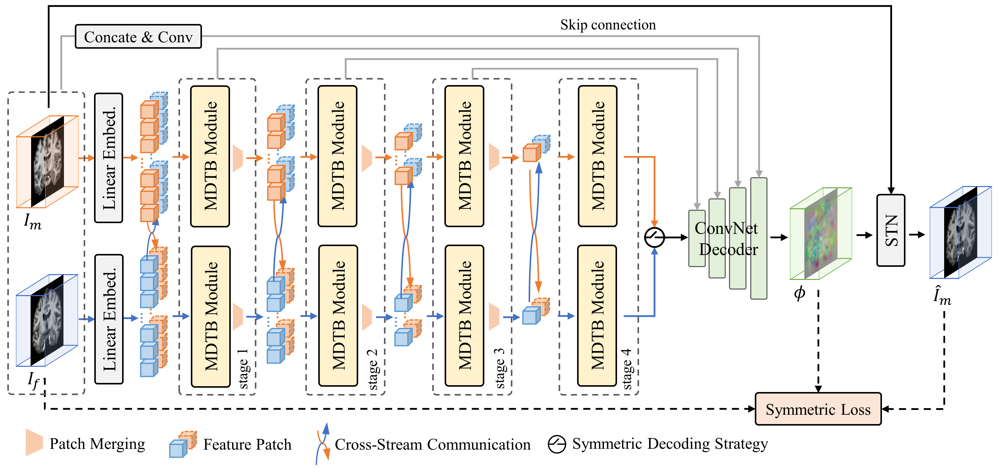

# DilateMorph

> [DilateMorph]()

The implementation of DilateMorph is released soon

## Abstract

<!-- [ABSTRACT] -->

DilateMorph

<!-- [IMAGE] -->

<div align=center>

</div>

## Results and models

### IXI

### LPBA40

### OASIS


## Quick Start

<details>
<summary>Train Instructions</summary>

You can use the following commands to train a model with cpu or single/multiple GPUs.

```shell
# cpu train
CUDA_VISIBLE_DEVICES=-1 python tools/train.py configs/registration/dilatemorph/dilatemorph_ixi_atlas-to-scan_160x192x224.py

# single-gpu train
python tools/train.py configs/registration/dilatemorph/dilatemorph_ixi_atlas-to-scan_160x192x224.py

# multi-gpu train
./tools/dist_train.sh configs/registration/dilatemorph/dilatemorph_ixi_atlas-to-scan_160x192x224.py 4
```
</details>

<details>
<summary>Test Instructions</summary>

You can use the following commands to test a model with cpu or single/multiple GPUs.

```shell
# cpu test
CUDA_VISIBLE_DEVICES=-1 python tools/test.py configs/registration/dilatemorph/dilatemorph_ixi_atlas-to-scan_160x192x224.py path/to/checkpoint.pth

# single-gpu test
python tools/test.py configs/registration/dilatemorph/dilatemorph_ixi_atlas-to-scan_160x192x224.py path/to/checkpoint.pth

# multi-gpu test
./tools/dist_test.sh configs/registration/dilatemorph/dilatemorph_ixi_atlas-to-scan_160x192x224.py path/to/checkpoint.pth 4
```
</details>

## Citation
