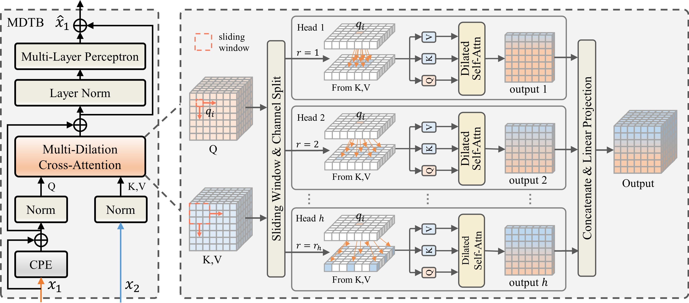

# DilateMorph

> [DilateMorph: A Dual-Stream Transformer with Multi-Dilation Cross-Attention for Medical Image Registration](https://www.sciencedirect.com/science/Article/abs/pii/S1361841522002432)

**The implementation of DilateMorph is released soon**

## Abstract

<!-- [ABSTRACT] -->

Image registration, a pivotal technique in medical image analysis,
faces the challenge of establishing high-precision spatial correspondences across images.
Although convolutional networks can expand local receptive field by enlarging kernel size,
their inherent hierarchical architecture and limited network depth still struggle to capture global dependencies.
In contrast, Transformer-based architectures achieve long-range modeling through self-attention,
but suffer from quadratic computational complexity with respect to the number of tokens.
In this paper, we propose a novel dual-stream registration framework, termed DilateMorph,
which leverages multi-dilation cross-attention (MDCA) to achieve efficient feature correlation
and matching while preserving global perception. Specifically,
dual-stream branches with multi-dilation Transformer block (MDTB) independently encode input images,
while a cross-stream communication (CSC) mechanism is introduced during encoding
to enhance feature interaction between the two streams.
Within this process, MDCA is designed to extract and explicitly match multi-level feature pairs,
enabling anatomical structure alignment across broader regions.
Subsequently, a symmetric decoding strategy (SDS) is adopted to alternately decode the encoded multi-scale features
into bidirectional deformation fields, effectively strengthening the inverse consistency of fields.
Extensive experiments on multiple public datasets, covering both unimodal and multimodal registration tasks,
demonstrate that DilateMorph achieves significant advantages in registration accuracy and computational efficiency,
highlighting its potential for medical image registration applications.
The code is publicly available at https://github.com/huaibovip/DilateMorph_TMI.

<!-- [IMAGE] -->

<div align=center>


</div>

## Results and models

### IXI

### LPBA40

### OASIS


## Quick Start

<details>
<summary>Train Instructions</summary>

You can use the following commands to train a model with cpu or single/multiple GPUs.

```shell
# cpu train
CUDA_VISIBLE_DEVICES=-1 python tools/train.py configs/registration/dilatemorph/dilatemorph_ixi_atlas-to-scan_160x192x224.py

# single-gpu train
python tools/train.py configs/registration/dilatemorph/dilatemorph_ixi_atlas-to-scan_160x192x224.py

# multi-gpu train
./tools/dist_train.sh configs/registration/dilatemorph/dilatemorph_ixi_atlas-to-scan_160x192x224.py 4
```
</details>

<details>
<summary>Test Instructions</summary>

You can use the following commands to test a model with cpu or single/multiple GPUs.

```shell
# cpu test
CUDA_VISIBLE_DEVICES=-1 python tools/test.py configs/registration/dilatemorph/dilatemorph_ixi_atlas-to-scan_160x192x224.py path/to/checkpoint.pth

# single-gpu test
python tools/test.py configs/registration/dilatemorph/dilatemorph_ixi_atlas-to-scan_160x192x224.py path/to/checkpoint.pth

# multi-gpu test
./tools/dist_test.sh configs/registration/dilatemorph/dilatemorph_ixi_atlas-to-scan_160x192x224.py path/to/checkpoint.pth 4
```
</details>

## Citation

```bibtex
@Article{paper,
  title = {DilateMorph: A Dual-Stream Transformer with Multi-Dilation Cross-Attention for Medical Image Registration},
  author = {},
}
```